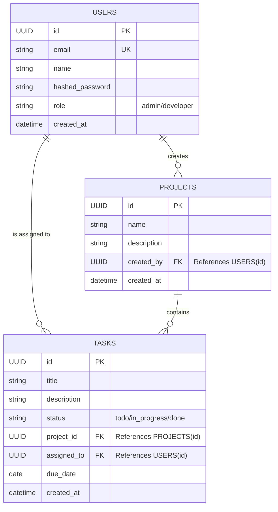

# Mini Project Management API + Dashboard

A full-stack project management application built to manage users, projects, and task assignments. 

## Table of Contents
1. [Architecture Explanation](#architecture-explanation)
2. [ER Diagram](#er-diagram)
3. [Setup Steps](#setup-steps)
4. [API Documentation](#api-documentation)

---

## 1. Architecture Explanation

The application follows a **Clean, Layered Architecture** for the backend, maintaining separation of concerns, scalability, testability, and standard HTTP protocols.

### Backend (FastAPI + Python)
The backend is structured into distinct layers:
- **Routers/Controllers (`app/api/v1`)**: Handles HTTP requests, validates incoming query parameters, and returns standardized JSON API responses with proper HTTP status codes.
- **Services (`app/services`)**: Contains the core business logic. It orchestrates checks (e.g., verifying user permissions or validating task existence) before interacting with the database layer.
- **Repositories (`app/repositories`)**: Abstracts the database interactions. Serves as the single source of truth for all DB queries, relying on SQLAlchemy DB sessions and transactions.
- **Schemas (`app/schemas`)**: Defines Pydantic models for strict Data validation and Response serialization, guaranteeing input/output data integrity.
- **Models (`app/models`)**: Database schema mapping definitions managed by SQLAlchemy and Alembic (for DB migrations).
- **Security**: Utilizes **JWT (JSON Web Tokens)** for stateless authentication. Bearer tokens are issued upon login and required for all protected API routes.

### Frontend (Next.js + React)
- The frontend uses Next.js (App Router) for internal routing, loading interactive UI dashboards, and page rendering. 
- **State & Storage**: JWT Access Tokens and Refresh Tokens are securely implemented. The backend attaches them as strict `HttpOnly` Cookies upon login, meaning the browser automatically securely transmits them. They are fully protected from cross-site scripting (XSS) client-side storage threats.

### Infrastructure
- **PostgreSQL**: Relational database handling all persistence gracefully.
- **Docker**: Fully containerized environment orchestrating the `db`, `backend`, and `frontend` services via Docker Compose.

---

## 2. ER Diagram

The ER Diagram outlines the core database entities and their relational constraints:



*Relationship Summary:*
* A **User** can create and manage multiple **Projects** (1-to-Many).
* A **Project** acts as an umbrella containing multiple **Tasks** (1-to-Many).
* A **Task** is selectively assigned directly down to an individual **User** account (1-to-Many).

---

## 3. Setup Steps

### Prerequisites
* Docker and Docker Compose installed on your local machine.
* Git installed.

### Local Environment Setup
1. **Clone the repository** (if applicable) and pull the project into a fresh root directory.
2. **Review Environment Variables**
   The project includes a `.env.example` file mapped to the root directory documenting the required settings. The default `docker-compose.yml` natively parses these values so it works automatically out of the box!
3. **Run using Docker Compose**
   Launch your terminal in the root directory and build the instances by running:
   ```bash
   docker-compose up -d --build
   ```
4. **Access the Application Interfaces**
   * **Frontend Dashboard**: Navigate to [http://localhost:3000](http://localhost:3000)
   * **Backend Swagger API Console**: Navigate to [http://localhost:8000/docs](http://localhost:8000/docs)

### Application Workflow (Important for Evaluation)
To enforce proper Role-Based Access Control (RBAC), the frontend UI does **not** have a public registration page. This ensures only authorized users exist within the organization.

**How to test the system:**
1. **Create the Admin:** Open the provided Postman collection (or navigate to Swagger at `http://localhost:8000/docs`). Send a `POST` request to `/api/v1/auth/register` with your desired admin credentials (e.g., `email`, `password`, `name`). *Note: The very first user created in the database is automatically assigned the `Admin` role.*
2. **Login as Admin:** Go to the frontend dashboard at `http://localhost:3000/login` and log in with the credentials you just created.
3. **Provision the Team:** From the dashboard, navigate to the **"Team"** tab (only visible to Admins) to manually create `Developer` accounts.
4. **Developer Login:** Your added developers can now log in using the credentials you assigned to them. They will only see the projects and tasks assigned to them and cannot create new users.

### Alternative Local Run (Without Docker)
If you prefer running natively without virtualization:
1. Create a local PostgreSQL Database instance and edit the `DATABASE_URL` property in `.env`.
2. Boot Backend (Terminal 1):
   ```bash
   cd backend
   pip install -r requirements.txt
   alembic upgrade head
   uvicorn app.main:app --port 8000 --reload
   ```
3. Boot Frontend (Terminal 2):
   ```bash
   cd frontend
   npm install
   npm run dev
   ```

---

## 4. API Documentation

The backend service actively serves an interactive, fully compliant **Swagger OpenAPI Documentation UI** at `http://localhost:8000/docs` while running. 

Below is a breakdown of the comprehensive endpoints available:

### Security & Authentication
* `POST /api/v1/auth/login` - Authenticate an active user with email/password to retrieve a valid **JWT Access Token & Refresh Token**.
*(Note: These tokens are automatically dispatched back inside strict `HttpOnly` Cookies. All subsequent requests automatically transmit them to `Depends` authorization routes, maintaining stateless highly-secure sessions).*
* `POST /api/v1/auth/refresh` - Issues a new token pair using the `HttpOnly` Refresh Token.
* `POST /api/v1/auth/logout` - Completely clears and wipes the secure session tokens.
### CRUD APIs - Users
* `POST /api/v1/users` - Register / Create a new system user profile.
* `GET /api/v1/users` - List all workspace users. (Supports Query Pagination: `?page=1&limit=100`)

### CRUD APIs - Projects
* `POST /api/v1/projects` - Spin up a new blank project.
* `GET /api/v1/projects` - Overview all projects attached to current workspaces. (Paginated)
* `PUT /api/v1/projects/{project_id}` - Update a project's core details.
* `DELETE /api/v1/projects/{project_id}` - Deletion route for a target project.

### CRUD APIs - Tasks
* `POST /api/v1/tasks` - Generate a new actionable task ticket.
* `GET /api/v1/tasks` - List tasks globally. Highly filterable via params: `?status=in_progress`, `?project_id={uuid}`, and `?assigned_to={uuid}` supporting pagination formatting.
* `PUT /api/v1/tasks/{task_id}/status` - Quick update of task status flags (`todo`, `in_progress`, `done`).
* `PUT /api/v1/tasks/{task_id}/assign` - Re-assign a task target to another User pipeline.
* `DELETE /api/v1/tasks/{task_id}` - Perform a complete destruction of a task record.

> **Testing via Postman:**
> A `postman_collection.json` definition script is additionally housed in the root folder alongside this README. You can instantly import it into your native Postman desktop/web client to test all mapped out scenarios securely formatted!
